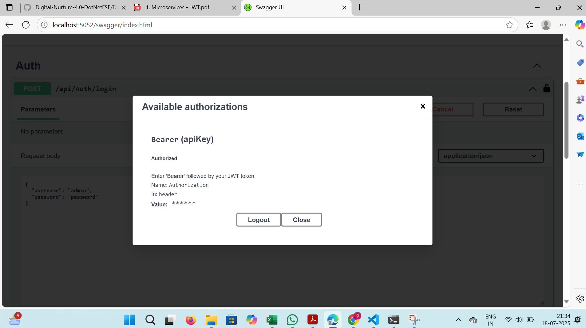

# Final Output - JWT Authentication Demo

This project demonstrates JWT-based authentication in ASP.NET Core Web API.

---

##  Authenticated API Output

###  Validations Done:
- Token generation via login endpoint.
- Token used in Swagger **Authorize** popup.
- Protected endpoints accessed successfully.

---
